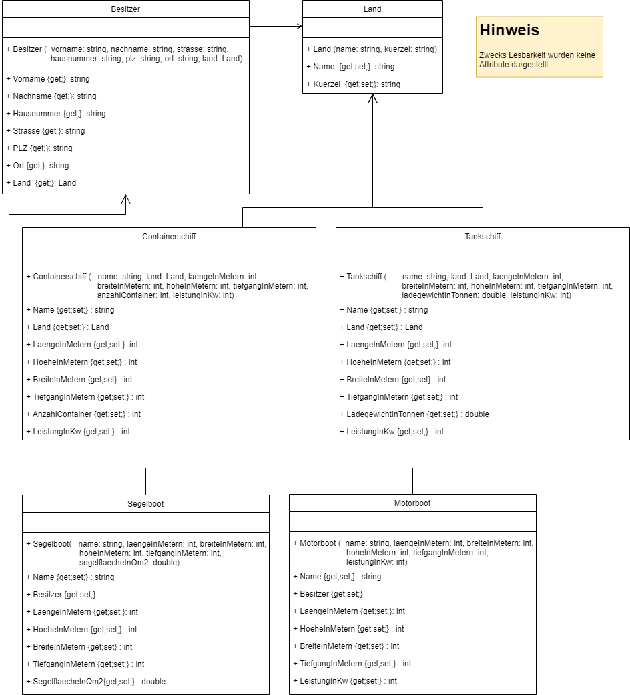

# Schiffe und Boote mit Vererbung
Diese Variante bietet den Vorteil, dass wir weniger Code wiederholen müssen. Danke [Vererbung](https://learn.microsoft.com/de-de/dotnet/csharp/fundamentals/object-oriented/inheritance) :pray:! 

Außerdem können wir nun alle Schiffe und Botte in einer gemeinsamen Liste vom Typ `Wasserfahrzeug` verwalten. Das nennt man [Polymorphie](https://learn.microsoft.com/de-de/dotnet/csharp/fundamentals/object-oriented/polymorphism).

Hier das Modell der enthaltenen Klassen:

